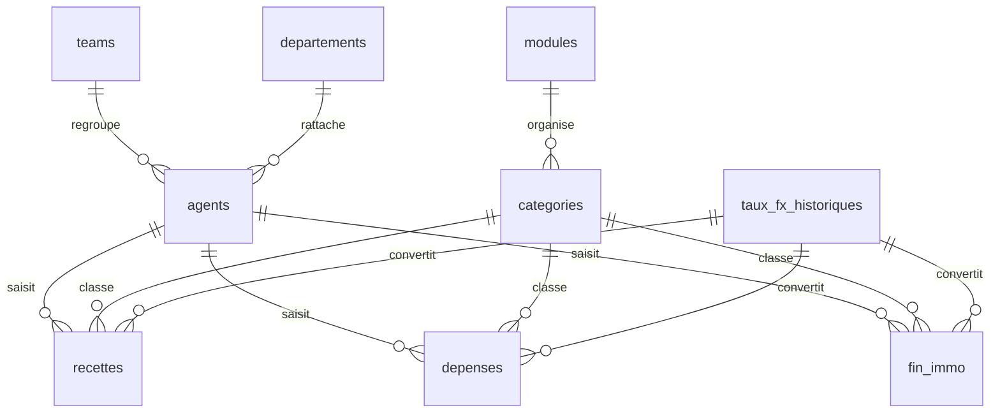

# M3S - Standard de structuration des tables

Date: 2026-06-19
Statut: document de cadrage avant migration/chargement Fin Immo

## Objectif

Ce document fixe un standard commun pour les tables M3S afin d'eviter les incoherences entre frontend, backend, BigQuery et fichiers sources.

Le probleme a regler est recurrent: les memes notions existent sous plusieurs noms selon les modules ou les sources (`income`, `recettes`, `expenses`, `depenses`, `team`, `departement`, etc.). La prochaine etape doit donc etre une normalisation avant d'ajouter de nouvelles donnees, notamment Fin Immo.

## Principe directeur

Chaque table doit avoir:

- une identite stable;
- une traçabilite claire;
- une liaison aux referentiels communs;
- une compatibilite multidevise CHF/CFA;
- des colonnes coherentes avec les autres modules.

Le frontend peut afficher des libelles traduits, mais les champs techniques doivent rester standards.

## Colonnes communes obligatoires

Ces colonnes devraient exister sur toutes les tables metier importantes.

| Champ standard | Type recommande | Description |
| --- | --- | --- |
| `id` | STRING | Identifiant technique unique. |
| `ref` | STRING | Numero de reference lisible, ex. `FIN-DEP-2026-0001`. |
| `date_operation` | DATE | Date principale de l'operation. |
| `agent_id` | STRING | Agent/responsable de la saisie ou de l'action. |
| `team_id` | STRING | Equipe ou BU rattachee. |
| `departement_id` | STRING | Departement/fonction metier. |
| `module_id` | STRING | Module M3S concerne: `FINANCE`, `RH`, `GED`, etc. |
| `phase_projet_id` | STRING | Phase projet standardisee. |
| `statut` | STRING | Statut canonique: `A_FAIRE`, `EN_COURS`, `TERMINE`, etc. |
| `source` | STRING | Origine de la donnee: manuel, BigQuery, Genspark, Excel, API. |
| `source_ref` | STRING | Reference externe optionnelle. |
| `notes` | STRING | Commentaire libre. |
| `created_at` | TIMESTAMP | Date de creation technique. |
| `updated_at` | TIMESTAMP | Date de derniere modification. |

## Colonnes financieres multidevise

Toutes les tables contenant un montant doivent contenir ces colonnes, meme si l'affichage final ne montre pas toujours tout.

| Champ standard | Type recommande | Description |
| --- | --- | --- |
| `montant_origine` | NUMERIC | Montant saisi ou importe dans la devise d'origine. |
| `devise_origine` | STRING | `CHF` ou `CFA` principalement. |
| `montant_chf` | NUMERIC | Montant converti en CHF. |
| `montant_cfa` | NUMERIC | Montant converti en CFA. |
| `taux_fx` | NUMERIC | Taux utilise pour la conversion. |
| `date_taux_fx` | DATE | Date du taux applique. |
| `source_taux_fx` | STRING | Source du taux: BCEAO, Wise.com, manuel, etc. |
| `fx_rate_id` | STRING | Lien vers la table historique des taux. |

Regle:

- Si `devise_origine = CHF`, `montant_chf = montant_origine` et `montant_cfa = montant_origine * taux_fx`.
- Si `devise_origine = CFA`, `montant_cfa = montant_origine` et `montant_chf = montant_origine / taux_fx`.
- Le taux courant est un indicateur; les operations historiques doivent conserver le taux utilise au moment de l'operation.

## Phases projet standard

Les phases doivent etre gerees comme referentiel et non comme texte libre.

| `phase_projet_id` | Libelle FR | Usage |
| --- | --- | --- |
| `CONCEPTION` | Conception | Idee, cadrage, design, analyse. |
| `MISE_EN_PLACE` | Mise en Place | Execution initiale, configuration, lancement. |
| `CONSOLIDATION` | Consolidation | Stabilisation, controles, corrections. |
| `DYNAMISATION` | Dynamisation | Croissance, animation, optimisation. |

## Referentiels a creer ou stabiliser

Ces tables evitent les valeurs libres et les divergences entre modules.

### `agents`

| Champ | Description |
| --- | --- |
| `agent_id` | Identifiant agent. |
| `nom_complet` | Nom affiche. |
| `email` | Email principal. |
| `role_id` | Role applicatif/metier. |
| `team_id` | Equipe rattachee. |
| `departement_id` | Departement rattache. |
| `statut` | Actif/Inactif. |

### `teams`

| Champ | Description |
| --- | --- |
| `team_id` | Identifiant equipe/BU. |
| `nom` | Nom de l'equipe. |
| `pays` | Pays principal si applicable. |
| `responsable_agent_id` | Responsable. |

### `departements`

| Champ | Description |
| --- | --- |
| `departement_id` | Identifiant departement. |
| `nom` | Finance, RH, Operations, IT, Commercial, etc. |
| `module_id` | Module principal rattache. |

### `modules`

| Champ | Description |
| --- | --- |
| `module_id` | Identifiant canonique. |
| `nom_fr` | Libelle francais. |
| `nom_en` | Libelle anglais. |
| `nom_de` | Libelle allemand. |

### `categories`

| Champ | Description |
| --- | --- |
| `categorie_id` | Identifiant canonique. |
| `module_id` | Module concerne. |
| `type_operation` | `RECETTE`, `DEPENSE`, `ACTIF`, `DOCUMENT`, etc. |
| `nom_fr` | Libelle FR. |
| `nom_en` | Libelle EN. |
| `nom_de` | Libelle DE. |

### `taux_fx_historiques`

| Champ | Description |
| --- | --- |
| `fx_rate_id` | Identifiant unique. |
| `date_taux` | Date du taux. |
| `devise_base` | Devise source. |
| `devise_cible` | Devise cible. |
| `taux` | Taux. |
| `source` | Source: BCEAO, Wise.com, manuel. |
| `created_at` | Date de creation. |

## Tables Finance recommandees

### `recettes`

Colonnes specifiques:

- `description`
- `categorie_id`
- `client_id` ou `partenaire_id` si applicable
- colonnes communes
- colonnes financieres multidevise

### `depenses`

Colonnes specifiques:

- `description`
- `categorie_id`
- `fournisseur_id` si applicable
- `justificatif_document_id` si GED liee
- colonnes communes
- colonnes financieres multidevise

### `fin_immo`

Colonnes specifiques:

- `projet_id`
- `bien_id` ou `actif_id`
- `type_flux`: `INVESTISSEMENT`, `REMBOURSEMENT`, `CHARGE`, `RECETTE_IMMO`, etc.
- `categorie_id`
- `justificatif_document_id`
- colonnes communes
- colonnes financieres multidevise

## Relations principales

## Convention de nommage

On evite les anglicismes inutiles dans les donnees metier francophones.

Champs techniques:

- snake_case en minuscules;
- pas d'accents;
- pas d'espaces;
- suffixe `_id` pour les references;
- dates au format `DATE` ou `TIMESTAMP`, jamais texte libre.

Libelles affiches:

- FR/EN/DE geres cote frontend ou table de referentiel;
- les valeurs canoniques restent stables.

Exemples:

- utiliser `recettes`, pas `income`;
- utiliser `depenses`, pas `expenses`;
- utiliser `taches`, pas `tasks`;
- utiliser `montant_chf` et `montant_cfa`, pas un seul champ `amount`.

## Strategie de migration

1. Inventorier les tables actuelles BigQuery et fichiers sources.
2. Creer un mapping source -> standard pour chaque table.
3. Nettoyer les noms de colonnes et valeurs canoniques.
4. Creer ou completer les referentiels: agents, teams, departements, categories, phases, taux FX.
5. Recharger les tables propres dans BigQuery.
6. Adapter les endpoints backend pour renvoyer les champs standards.
7. Adapter le frontend pour afficher les colonnes standards.
8. Charger Fin Immo seulement apres validation du standard.

## Priorite prochaine

Avant chargement Fin Immo:

- definir le mapping `recettes`;
- definir le mapping `depenses`;
- definir le mapping `fin_immo`;
- verifier les taux FX historiques;
- valider les colonnes communes avec Agent, Team, Departement, Phase Projet, Reference.

