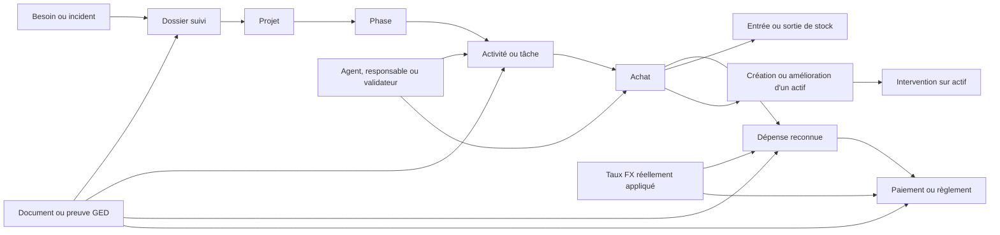
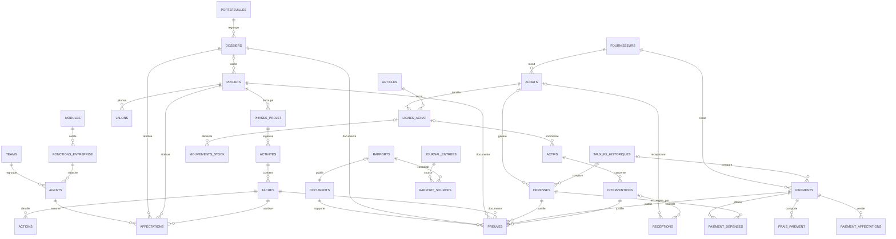

# M3S - Standard de structuration des tables

Date d'origine: 2026-06-19
Revision: 2026-08-16
Statut: standard relationnel V1 valide au niveau cadrage/interface sur trois cas pilotes; migration de production non autorisee

## Objectif

Ce document fixe un standard commun pour les tables M3S afin d'eviter les incoherences entre frontend, backend, BigQuery et fichiers sources.

Le probleme a regler est recurrent: les memes notions existent sous plusieurs noms selon les modules ou les sources (`income`, `recettes`, `expenses`, `depenses`, `team`, `departement`, etc.). La prochaine etape doit donc etre une normalisation avant d'ajouter de nouvelles donnees, notamment Fin Immo.

## Principe directeur

Chaque table doit avoir:

- une identite stable;
- une traçabilite claire;
- une liaison aux referentiels communs;
- une compatibilite multidevise CHF/CFA;
- des colonnes coherentes avec les autres modules.

Le frontend peut afficher des libelles traduits, mais les champs techniques doivent rester standards.

## Colonnes communes obligatoires

Ces colonnes devraient exister sur toutes les tables metier importantes.

| Champ standard | Type recommande | Description |
| --- | --- | --- |
| `id` | STRING | Identifiant technique unique. |
| `ref` | STRING | Numero de reference lisible, ex. `FIN-DEP-2026-0001`. |
| `date_operation` | DATE | Date principale de l'operation. |
| `agent_id` | STRING | Auteur de la saisie ou acteur de l'evenement ; ne remplace pas une affectation de responsabilite. |
| `team_id` | STRING | Equipe ou BU rattachee. |
| `fonction_id` | STRING | Fonction d'entreprise proprietaire du traitement. |
| `departement_id` | STRING | Champ historique conserve comme alias de migration jusqu'a validation du mapping vers `fonction_id`. |
| `module_id` | STRING | Module M3S concerne: `FINANCE`, `RH`, `GED`, etc. |
| `dossier_id` | STRING | Dossier de suivi lorsqu'il existe. |
| `projet_id` | STRING | Projet auquel l'enregistrement contribue lorsqu'il existe. |
| `phase_projet_id` | STRING | Phase projet standardisee ; ancien nom a rapprocher de `phase_id`. |
| `tache_id` | STRING | Tache executee ou concernee lorsqu'elle est connue. |
| `statut` | STRING | Statut canonique: `A_FAIRE`, `EN_COURS`, `TERMINE`, etc. |
| `source` | STRING | Origine de la donnee: manuel, BigQuery, Genspark, Excel, API. |
| `source_ref` | STRING | Reference externe optionnelle. |
| `notes` | STRING | Commentaire libre. |
| `created_at` | TIMESTAMP | Date de creation technique. |
| `updated_at` | TIMESTAMP | Date de derniere modification. |

## Colonnes financieres multidevise

Toutes les tables contenant un montant doivent contenir ces colonnes, meme si l'affichage final ne montre pas toujours tout.

| Champ standard | Type recommande | Description |
| --- | --- | --- |
| `montant_origine` | NUMERIC | Montant saisi ou importe dans la devise d'origine. |
| `devise_origine` | STRING | `CHF` ou `CFA` principalement. |
| `montant_chf` | NUMERIC | Montant converti en CHF. |
| `montant_cfa` | NUMERIC | Montant converti en CFA. |
| `taux_applique` | NUMERIC | Taux effectivement utilise pour l'operation historique. |
| `date_taux_applique` | DATE | Date du taux effectivement applique. |
| `source_taux_applique` | STRING | Prestataire, fournisseur ou source qui a applique le taux. |
| `reference_fx_rate_id` | STRING | Lien optionnel vers un taux historique independant utilise uniquement pour comparaison. |
| `taux_fx` | NUMERIC | Champ historique a mapper vers `taux_applique`, sans suppression avant migration gouvernee. |

Regle:

- Si `devise_origine = CHF`, `montant_chf = montant_origine` et `montant_cfa = montant_origine * taux_applique`.
- Si `devise_origine = CFA`, `montant_cfa = montant_origine` et `montant_chf = montant_origine / taux_applique`.
- Le taux de reference courant ou historique est un indicateur independant; les operations conservent le taux effectivement applique au moment de l'evenement.
- Le taux de reference ne corrige ni ne reecrit retrospectivement une operation historique.

## Phases projet standard

Les phases doivent etre gerees comme referentiel et non comme texte libre.

| `phase_projet_id` | Libelle FR | Usage |
| --- | --- | --- |
| `CONCEPTION` | Conception | Idee, cadrage, design, analyse. |
| `MISE_EN_PLACE` | Mise en Place | Execution initiale, configuration, lancement. |
| `CONSOLIDATION` | Consolidation | Stabilisation, controles, corrections. |
| `DYNAMISATION` | Dynamisation | Croissance, animation, optimisation. |

## Referentiels a creer ou stabiliser

Ces tables evitent les valeurs libres et les divergences entre modules.

### `agents`

| Champ | Description |
| --- | --- |
| `agent_id` | Identifiant agent. |
| `nom_complet` | Nom affiche. |
| `email` | Email principal. |
| `role_id` | Role applicatif/metier. |
| `team_id` | Equipe rattachee. |
| `fonction_id` | Fonction d'entreprise principale. |
| `departement_id` | Rattachement historique a mapper, sans l'utiliser pour les nouvelles structures. |
| `statut` | Actif/Inactif. |

### `teams`

| Champ | Description |
| --- | --- |
| `team_id` | Identifiant equipe/BU. |
| `nom` | Nom de l'equipe. |
| `pays` | Pays principal si applicable. |
| `responsable_agent_id` | Responsable. |

### `fonctions_entreprise`

| Champ | Description |
| --- | --- |
| `fonction_id` | Identifiant de la fonction d'entreprise. |
| `nom` | Administration, Finances, RH, Operations, IT, Commercial, etc. |
| `module_id` | Module principal rattache. |

### `departements` - heritage de migration

| Champ | Description |
| --- | --- |
| `departement_id` | Identifiant historique conserve pour tracabilite. |
| `fonction_id_cible` | Fonction d'entreprise cible apres mapping valide. |
| `statut_mapping` | A qualifier, confirme ou remplace. |

### `modules`

| Champ | Description |
| --- | --- |
| `module_id` | Identifiant canonique. |
| `nom_fr` | Libelle francais. |
| `nom_en` | Libelle anglais. |
| `nom_de` | Libelle allemand. |

### `categories`

| Champ | Description |
| --- | --- |
| `categorie_id` | Identifiant canonique. |
| `module_id` | Module concerne. |
| `type_operation` | `RECETTE`, `DEPENSE`, `ACTIF`, `DOCUMENT`, etc. |
| `nom_fr` | Libelle FR. |
| `nom_en` | Libelle EN. |
| `nom_de` | Libelle DE. |

### `taux_fx_historiques`

| Champ | Description |
| --- | --- |
| `fx_rate_id` | Identifiant unique. |
| `date_taux` | Date du taux. |
| `devise_base` | Devise source. |
| `devise_cible` | Devise cible. |
| `taux` | Taux. |
| `source` | Source: BCEAO, Wise.com, manuel. |
| `created_at` | Date de creation. |

## Tables Finance recommandees

### `recettes`

Colonnes specifiques:

- `description`
- `categorie_id`
- `client_id` ou `partenaire_id` si applicable
- colonnes communes
- colonnes financieres multidevise

### `depenses`

Colonnes specifiques:

- `description`
- `categorie_id`
- `fournisseur_id` si applicable
- `justificatif_document_id` si GED liee
- colonnes communes
- colonnes financieres multidevise

### `fin_immo`

Colonnes specifiques:

- `projet_id`
- `bien_id` ou `actif_id`
- `type_flux`: `INVESTISSEMENT`, `REMBOURSEMENT`, `CHARGE`, `RECETTE_IMMO`, etc.
- `categorie_id`
- `justificatif_document_id`
- colonnes communes
- colonnes financieres multidevise

## Socle relationnel transversal V1

### Lecture métier simplifiée

Le modèle relie le pilotage, l'exécution, la finance, les stocks, les actifs et les preuves sans confondre leurs responsabilités.


```mermaid
flowchart LR
  BESOIN["Besoin ou incident"] --> DOSSIER["Dossier suivi"]
  DOSSIER --> PROJET["Projet"]
  PROJET --> PHASE["Phase"]
  PHASE --> TACHE["Activité ou tâche"]
  TACHE --> ACHAT["Achat"]
  ACHAT --> DEPENSE["Dépense reconnue"]
  DEPENSE --> PAIEMENT["Paiement ou règlement"]
  ACHAT --> STOCK["Entrée ou sortie de stock"]
  ACHAT --> ACTIF["Création ou amélioration d'un actif"]
  ACTIF --> INTERVENTION["Intervention sur actif"]
  AGENT["Agent, responsable ou validateur"] --> TACHE
  AGENT --> ACHAT
  PREUVE["Document ou preuve GED"] --> DOSSIER
  PREUVE --> TACHE
  PREUVE --> DEPENSE
  PREUVE --> PAIEMENT
  FX["Taux FX réellement appliqué"] --> DEPENSE
  FX --> PAIEMENT
```

Règles de lecture :

- un dossier peut exister sans projet, par exemple un contentieux, une obligation ou un incident ;
- un projet peut être découpé en phases, activités, tâches et actions, mais aucun niveau vide ne doit être créé artificiellement ;
- un achat décrit la commande ou l'acquisition ; une dépense décrit l'impact financier ; un paiement décrit le règlement effectif ;
- un achat stockable génère un mouvement de stock après réception, tandis qu'un bien durable peut créer ou améliorer un actif ;
- une preuve reste conservée dans la GED et est reliée à l'objet métier concerné ;
- le taux TFX courant est indicatif ; la depense et le paiement conservent le taux reellement applique par le prestataire, la banque, le fournisseur ou une autre source autorisee.

### Objets de pilotage

| Objet | Finalité | Champs de relation principaux |
| --- | --- | --- |
| `portefeuilles` | Regrouper les grands dossiers, chantiers et projets. | `portefeuille_id`, `fonction_id`, `responsable_agent_id` |
| `dossiers` | Suivre une affaire, une obligation, un incident ou un chantier. | `dossier_id`, `portefeuille_id`, `type_dossier`, `statut`, `confidentialite` |
| `projets` | Piloter un résultat délimité dans le temps. | `projet_id`, `dossier_id`, `responsable_agent_id`, `statut` |
| `phases_projet` | Découper un projet en séquences gouvernées. | `phase_id`, `projet_id`, `phase_referentiel_id`, `ordre` |
| `activites` | Regrouper un travail cohérent dans une phase. | `activite_id`, `phase_id`, `responsable_agent_id` |
| `taches` | Décrire une unité de travail suivie. | `tache_id`, `activite_id`, `statut`, `priorite`, `echeance` |
| `actions` | Consigner une action élémentaire lorsque ce niveau est utile. | `action_id`, `tache_id`, `agent_id`, `statut` |
| `jalons` | Matérialiser une décision, une livraison, une réception ou un contrôle sans durée propre. | `jalon_id`, `projet_id`, `phase_id`, `date_cible` |

### Personnes, fonctions et responsabilités

Le champ `agent_id` des colonnes communes trace l'auteur de la saisie ou de l'événement. Il ne doit pas être utilisé seul pour déduire le responsable, le contrôleur ou le validateur.

| Objet | Finalité | Champs de relation principaux |
| --- | --- | --- |
| `agents` | Identifier une personne ou un acteur autorisé. | `agent_id`, `team_id`, `fonction_id`, `statut` |
| `fonctions_entreprise` | Porter la fonction métier : Administration, Finances, RH, etc. | `fonction_id`, `module_id`, libellés FR/DE/EN |
| `roles` | Décrire un rôle applicatif ou métier réutilisable. | `role_id`, `type_role`, `niveau_acces` |
| `affectations` | Relier un agent à un objet avec une responsabilité précise. | `affectation_id`, `agent_id`, `objet_type`, `objet_id`, `responsabilite`, `date_debut`, `date_fin` |

Pour les nouvelles structures, `fonction_id` est préféré à `departement_id`. Le champ historique `departement_id` doit être conservé comme alias de migration jusqu'à validation du mapping, sans suppression immédiate.

Responsabilités canoniques candidates :

```text
PORTEUR
RESPONSABLE
EXECUTANT
CONTROLEUR
VALIDATEUR
DECIDEUR
INFORME
```

### Achats, dépenses et paiements

| Objet | Finalité | Champs de relation principaux |
| --- | --- | --- |
| `fournisseurs` | Identifier le fournisseur ou prestataire. | `fournisseur_id`, `type_fournisseur`, `statut_verification` |
| `achats` | Décrire la demande, commande ou acquisition. | `achat_id`, `fournisseur_id`, `dossier_id`, `projet_id`, `tache_id`, `statut` |
| `lignes_achat` | Détailler articles, services, quantités et prix. | `ligne_achat_id`, `achat_id`, `article_id`, `type_ligne`, montants |
| `depenses` | Reconnaître et classer l'impact financier. | `depense_id`, `achat_id`, `categorie_id`, taux applique et rattachements de pilotage |
| `paiements` | Tracer le règlement réellement exécuté. | `paiement_id`, `fournisseur_id`, `date_paiement`, montants, taux applique et preuve |
| `frais_paiement` | Distinguer les frais du montant transfere ou regle. | `frais_id`, `paiement_id`, `type_frais`, montants et devises |
| `paiement_affectations` | Ventiler un paiement vers plusieurs objets ou destinations avant rapprochement comptable. | `affectation_id`, `paiement_id`, `objet_type`, `objet_id`, montants affectes |
| `paiement_depenses` | Affecter un paiement à une ou plusieurs dépenses. | `paiement_id`, `depense_id`, `montant_affecte` |

Règles :

- une dépense peut être réglée en plusieurs paiements ;
- un paiement peut couvrir plusieurs dépenses, à condition que l'affectation soit explicite ;
- les frais de transfert ou bancaires sont des objets separes du montant envoye ;
- une affectation de paiement explique une destination sans creer automatiquement une depense reconnue ;
- `montant_origine`, `devise_origine`, `montant_chf`, `montant_cfa`, `taux_applique`, `date_taux_applique` et `source_taux_applique` sont conserves sur l'evenement monetaire qui fait foi ;
- un indicateur TFX ne doit jamais réécrire un paiement historique.

### Stocks, actifs et interventions

| Objet | Finalité | Champs de relation principaux |
| --- | --- | --- |
| `articles` | Définir un produit, matériau ou consommable. | `article_id`, `categorie_id`, `unite`, `stockable` |
| `mouvements_stock` | Tracer une entrée, sortie, transfert ou correction. | `mouvement_id`, `article_id`, `ligne_achat_id`, `type_mouvement`, `quantite`, `projet_id`, `tache_id` |
| `actifs` | Identifier un bien durable, patrimonial ou numérique. | `actif_id`, `ligne_achat_id`, `type_actif`, `responsable_agent_id`, `statut` |
| `interventions` | Suivre des travaux, réparations, contrôles ou entretiens. | `intervention_id`, `actif_id`, `dossier_id`, `projet_id`, `fournisseur_id`, `statut` |
| `receptions` | Formaliser la réception quantitative et qualitative. | `reception_id`, `achat_id` ou `intervention_id`, `date_reception`, `resultat`, `validateur_agent_id` |

Le cas Villa LR1 peut utiliser ce modèle comme pilote sans devenir la définition générale : le bien est un actif, les avants et le mini-forage sont des interventions, leurs achats et paiements restent des objets financiers séparés, et la réception exige ses propres preuves.

### Documents, preuves, journaux et rapports

| Objet | Finalité | Champs de relation principaux |
| --- | --- | --- |
| `documents` | Référencer un document conservé dans la GED. | `document_id`, `ged_uri`, `type_document`, `version`, `statut_validation`, `confidentialite` |
| `preuves` | Qualifier le rôle probant d'un document pour un objet. | `preuve_id`, `document_id`, `objet_type`, `objet_id`, `type_preuve`, `date_verification` |
| `journal_entrees` | Consigner faits, décisions, résultats et points de reprise. | `journal_entree_id`, `date_session`, `type_entree`, `objet_type`, `objet_id`, `source_ref` |
| `rapports` | Produire une synthèse journalière, hebdomadaire, mensuelle ou d'activité. | `rapport_id`, `type_rapport`, `periode_debut`, `periode_fin`, `statut_validation`, `document_id` |
| `rapport_sources` | Relier un rapport à ses journaux et preuves. | `rapport_id`, `source_type`, `source_id`, `niveau_confiance` |

Les journaux et preuves sont des sources ; un rapport est une publication dérivée. Une correction de rapport ne doit pas réécrire silencieusement les sources historiques.

### Diagramme relationnel V1


```mermaid
erDiagram
  PORTEFEUILLES ||--o{ DOSSIERS : regroupe
  DOSSIERS o|--o{ PROJETS : cadre
  PROJETS ||--o{ PHASES_PROJET : decoupe
  PHASES_PROJET ||--o{ ACTIVITES : organise
  ACTIVITES ||--o{ TACHES : contient
  TACHES ||--o{ ACTIONS : detaille
  PROJETS ||--o{ JALONS : jalonne

  TEAMS ||--o{ AGENTS : regroupe
  FONCTIONS_ENTREPRISE ||--o{ AGENTS : rattache
  MODULES ||--o{ FONCTIONS_ENTREPRISE : outille
  AGENTS ||--o{ AFFECTATIONS : assume
  DOSSIERS ||--o{ AFFECTATIONS : attribue
  PROJETS ||--o{ AFFECTATIONS : attribue
  TACHES ||--o{ AFFECTATIONS : attribue

  FOURNISSEURS ||--o{ ACHATS : recoit
  ACHATS ||--|{ LIGNES_ACHAT : detaille
  ACHATS o|--o{ DEPENSES : genere
  FOURNISSEURS ||--o{ PAIEMENTS : recoit
  PAIEMENTS ||--o{ FRAIS_PAIEMENT : comporte
  PAIEMENTS ||--o{ PAIEMENT_AFFECTATIONS : ventile
  PAIEMENTS ||--o{ PAIEMENT_DEPENSES : affecte
  DEPENSES ||--o{ PAIEMENT_DEPENSES : est_reglee_par
  TAUX_FX_HISTORIQUES o|--o{ DEPENSES : compare
  TAUX_FX_HISTORIQUES o|--o{ PAIEMENTS : compare

  ARTICLES ||--o{ LIGNES_ACHAT : decrit
  LIGNES_ACHAT o|--o{ MOUVEMENTS_STOCK : alimente
  LIGNES_ACHAT o|--o{ ACTIFS : immobilise
  ACTIFS ||--o{ INTERVENTIONS : concerne
  ACHATS o|--o{ RECEPTIONS : receptionne
  INTERVENTIONS o|--o{ RECEPTIONS : controle

  DOCUMENTS ||--o{ PREUVES : supporte
  DOSSIERS ||--o{ PREUVES : documente
  PROJETS ||--o{ PREUVES : documente
  TACHES ||--o{ PREUVES : documente
  DEPENSES ||--o{ PREUVES : justifie
  PAIEMENTS ||--o{ PREUVES : justifie
  INTERVENTIONS ||--o{ PREUVES : justifie

  JOURNAL_ENTREES ||--o{ RAPPORT_SOURCES : source
  RAPPORTS ||--o{ RAPPORT_SOURCES : consolide
  RAPPORTS o|--|| DOCUMENTS : publie
```

### Contrat minimal de rattachement

Les objets transactionnels ne doivent pas tous exiger toutes les clés. En revanche, chaque enregistrement doit expliquer son rattachement sans texte libre ambigu.

| Champ | Règle |
| --- | --- |
| `dossier_id` | Utilisé lorsqu'un dossier administratif, juridique, patrimonial ou d'intervention porte le suivi. |
| `projet_id` | Utilisé lorsque l'opération contribue à un projet défini. |
| `phase_id` | Utilisé lorsque la phase est connue et gouvernée. |
| `activite_id` | Utilisé pour un regroupement opérationnel stable. |
| `tache_id` | Utilisé lorsque l'opération exécute une tâche précise. |
| `agent_id` | Auteur ou acteur de l'événement ; la responsabilité détaillée reste dans `affectations`. |
| `fonction_id` | Fonction d'entreprise propriétaire du traitement. |
| `module_id` | Module M3S dans lequel l'objet est géré ou affiché. |
| `document_id` | Pièce maîtresse ou justificatif, conservé dans la GED. |

### Registre de validation des cas pilotes

| Cas pilote | Relations controlees | Resultat au 16-08-2026 |
| --- | --- | --- |
| Villa LR1 | Un actif, plusieurs interventions, tâches, contrôles et preuves GED. | Valide au niveau cadrage/interface. |
| Transfert TFX | Taux applique, taux de reference, frais, preuves et affectations multiples. | Valide au niveau cadrage/interface. |
| Mission externe | Signal, dossier, affectations, livrables, contrôles et décision humaine. | Valide au niveau cadrage/interface. |

Cette validation 3/3 confirme la cohérence fonctionnelle des cardinalités. Elle ne vaut ni migration, ni homologation du schéma de production, ni autorisation d'exposer des données sensibles.

### Portes restant à franchir avant migration

1. Valider les noms des objets avec les fonctions métier concernées.
2. Cartographier les tables et endpoints existants vers ce modèle.
3. Distinguer champs disponibles, calculables, manquants et sensibles.
4. Produire un dictionnaire de données versionné avec propriétaires et statuts.
5. Préparer les migrations sans suppression de champ historique.
6. Modifier BigQuery, backend et frontend uniquement dans des micro-lots séparés et réversibles.

## Convention de nommage

On evite les anglicismes inutiles dans les donnees metier francophones.

Champs techniques:

- snake_case en minuscules;
- pas d'accents;
- pas d'espaces;
- suffixe `_id` pour les references;
- dates au format `DATE` ou `TIMESTAMP`, jamais texte libre.

Libelles affiches:

- FR/EN/DE geres cote frontend ou table de referentiel;
- les valeurs canoniques restent stables.

Exemples:

- utiliser `recettes`, pas `income`;
- utiliser `depenses`, pas `expenses`;
- utiliser `taches`, pas `tasks`;
- utiliser `montant_chf` et `montant_cfa`, pas un seul champ `amount`.

## Strategie de migration

1. Inventorier les tables actuelles BigQuery et fichiers sources.
2. Creer un mapping source -> standard pour chaque table.
3. Nettoyer les noms de colonnes et valeurs canoniques.
4. Creer ou completer les referentiels: agents, teams, fonctions d'entreprise, categories, phases et taux FX.
5. Recharger les tables propres dans BigQuery.
6. Adapter les endpoints backend pour renvoyer les champs standards.
7. Adapter le frontend pour afficher les colonnes standards.
8. Charger Fin Immo seulement apres validation du standard.

## Priorite prochaine

Avant chargement Fin Immo:

- definir le mapping `recettes`;
- definir le mapping `depenses`;
- definir le mapping `fin_immo`;
- verifier les taux FX historiques;
- valider les colonnes communes avec Agent, Team, Fonction d'entreprise, Phase Projet et Reference.

